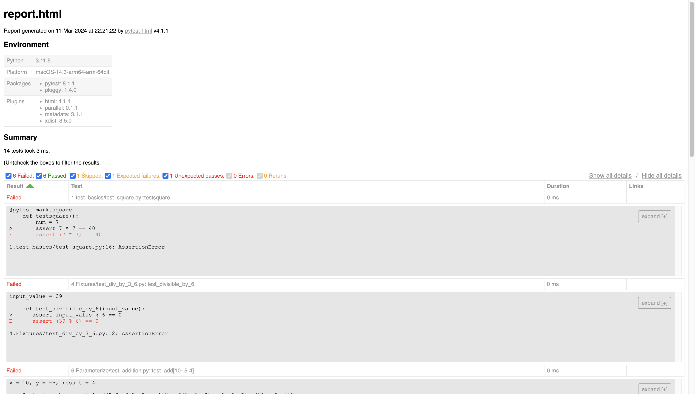

# Unofficial Pytest Tutorial 
Inspired by [tutorialspoint](https://www.tutorialspoint.com/pytest/)

### Pytest: Your Comprehensive Resource for Testing Queries

<!-- Page Break -->
***
## What is Pytest?
Pytest is a testing framework for Python that makes it easy to write simple and scalable tests. It allows you to write tests using a more concise and Pythonic syntax compared to the built-in unittest module. Pytest provides features such as fixtures, parameterized testing, and plugins, which make testing in Python more efficient and powerful.

Key features of pytest include:

1. **Simple syntax**: Pytest uses simple and intuitive syntax for writing tests, making it easy for developers to create and maintain test code.

2. **Fixture support**: Pytest provides a powerful fixture mechanism for managing test dependencies and setup. Fixtures allow you to set up and tear down resources needed for tests, such as database connections, temporary files, or web servers.

3. **Parameterized testing**: Pytest supports parameterized testing, allowing you to run the same test with different inputs or configurations. This can help reduce code duplication and make tests more expressive.

4. **Plugin system**: Pytest has a rich ecosystem of plugins that extend its functionality. Plugins can provide additional features such as code coverage analysis, test result reporting, and integration with other tools and frameworks.

5. **Integration with other testing tools**: Pytest can be easily integrated with other testing tools and libraries, such as code coverage tools (e.g., Coverage Python), continuous integration servers (e.g., Jenkins), and mocking libraries (e.g., pytest-mock).

Overall, pytest is a popular choice for testing Python applications due to its simplicity, flexibility, and extensibility. It's widely used in both open-source projects and commercial software development for writing unit tests, integration tests, and functional tests.

<!-- Page Break -->
***
## Common Pytest Flags

Some common pytest flags are

1. `-v`, `--verbose`: Increase verbosity of output. This flag shows more detailed information about each test, including their names and outcomes.

2. `-q`, `--quiet`: Decrease verbosity of output. This flag suppresses most informational output and only displays essential information like test outcomes.

3. `-s`, `--capture=no`: Disable output capture. By default, pytest captures and hides the stdout/stderr output during test execution. This flag disables that behavior and shows the output in real-time.

4. `-k EXPRESSION`: Run only tests that match the given substring expression. This flag allows you to selectively run tests based on their names.

5. `-m MARKEXPR`: Run only tests matching the given marker expression. This flag allows you to selectively run tests based on their markers.

6. `-x`, `--exitfirst`: Exit instantly on first error or failed test. This flag stops the test run immediately upon encountering the first test failure or error.

7. `--maxfail=num`: Stop the test run after the specified number of test failures. This flag allows you to define a threshold for test failures before stopping the test run.

8. `--tb=style`: Set the traceback print mode. This flag allows you to customize the style of tracebacks displayed on test failure. Options include `long`, `short`, `line`, `native`, `no`, and `auto`.

9. `--durations=num`: Show N slowest test durations. This flag displays the N slowest test durations at the end of the test run, helping you identify slow-running tests.

10. `--html=path`: Generate HTML report file at given path. This flag saves the test outcomes and related information in an HTML report file for easy inspection.

11. `--junit-xml=path`: Write junit-xml style report file at given path. This flag generates an XML report file in JUnit-compatible format, which is commonly used for integration with continuous integration (CI) systems.

12. `--cov`: Measure code coverage. This flag enables code coverage measurement during test execution using the pytest-cov plugin. You can specify which modules or packages to measure coverage for.

There are many more flags available for various purposes, and you can explore them further in the pytest documentation or by running `pytest --help`.


<!-- Page Break -->
***
## Installation
1. Run the following command in your command line:
```
pip install -U pytest
```
2. Lets verify the installation
```
pytest --version
```
Expected ouput post installation
```
>>> pytest 8.1.1
```

<!-- Page Break -->
*** 
## Getting Started

#### How to identify or create test documents?

1. Running pytest without specifying a filename will execute all files with names in the format <b>test_*.py</b> or <b>*_test.py</b> in the current directory and its subdirectories. Pytest automatically recognizes these files as containing test cases. You can specify other filenames explicitly to be executed by pytest.

2. <b>Pytest mandates that test function names begin with test</b>. Functions not following this naming convention are not recognized as test functions by pytest. It's not possible to explicitly designate any function not starting with test as a test function.


**Valid Example File Names:**

- `test_square.py`
- `square_test.py`

These filenames adhere to standard naming conventions for test files in Python.

### 1. Pytest - Starting With Basic Test

Let's begin our exploration by cloning the repository and thoroughly examining the codebase.
1. test_basics
 * test_square.py
```
import math

# Test 1
# Test square root of 25 equals 5
def test_sqrt():
    num = 25
    assert math.sqrt(num) == 5

# Test 2
# Test if 7 squared equals 49
def testsquare():
    num = 7
    assert 7 * 7 == 40

# Invalid test name, Hence wont execute in our test
def tesequality():
    assert 10 == 11
```

To run the test 
```
pytest
```

Expected Outcome
```
=================================================== test session starts ====================================================
platform darwin -- Python 3.11.5, pytest-8.1.1, pluggy-1.4.0
rootdir: pytest_tutorial
collected 2 items                                                                                                          

1.test_basics/test_square.py .F                                                                                      [100%]

========================================================= FAILURES =========================================================
________________________________________________________ testsquare ________________________________________________________

    def testsquare():
        num = 7
>       assert 7 * 7 == 40
E       assert (7 * 7) == 40

1.test_basics/test_square.py:15: AssertionError
================================================= short test summary info ==================================================
FAILED 1.test_basics/test_square.py::testsquare - assert (7 * 7) == 40
=============================================== 1 failed, 1 passed in 0.01s ================================================ 
```

In the test result output, each line represents a test outcome. The file name is displayed at the beginning of the line, followed by a character indicating the result: "F" represents a test failure, while a dot (".") indicates a test success.

**Note:** The function tesequality is not executed by pytest because its name does not follow the naming convention expected by pytest. Test functions must be named with the format test* to be recognized and executed by pytest.

Now lets re-execute the test and see the results in more detailed form
```
pytest -v
```

-v means verbose

```
============================================================================================= test session starts ==============================================================================================
platform darwin -- Python 3.11.5, pytest-8.1.1, pluggy-1.4.0 -- /bin/python
cachedir: .pytest_cache
rootdir: pytest_tutorial
collected 2 items                                                                                                                                                                                              

1.test_basics/test_square.py::test_sqrt PASSED                                                                                                                                                           [ 50%]
1.test_basics/test_square.py::testsquare FAILED                                                                                                                                                          [100%]

=================================================================================================== FAILURES ===================================================================================================
__________________________________________________________________________________________________ testsquare __________________________________________________________________________________________________

    def testsquare():
        num = 7
>       assert 7 * 7 == 40
E       assert (7 * 7) == 40

1.test_basics/test_square.py:15: AssertionError
=========================================================================================== short test summary info ============================================================================================
FAILED 1.test_basics/test_square.py::testsquare - assert (7 * 7) == 40
========================================================================================= 1 failed, 1 passed in 0.01s ==========================================================================================
```

### 2. Pytest - Run a specific file
2. multiple_file_execution
 `test_compare.py`

In this chapter, we will explore how to execute both single and multiple test files. We've already created a test file named `test_square.py`. Now, let's create a new test file named `test_compare.py` with the following code.

```
# Test 1
# Test if num is greater than 100
def test_greater():
    num = 100
    assert num > 100

# Test 2
# Test if num is greater than or equal to 100
def test_greater_equal():
    num = 100
    assert num >= 100

# Test 3
# Test if num is less than 200
def test_less():
    num = 100
    assert num < 200
```

Now lets execute the test and see the results in detailed form
```
pytest -v
```

```
============================================================================================= test session starts ==============================================================================================
platform darwin -- Python 3.11.5, pytest-8.1.1, pluggy-1.4.0 -- /bin/python
cachedir: .pytest_cache
rootdir: pytest_tutorial
collected 5 items                                                                                                                                                                                              

1.test_basics/test_square.py::test_sqrt PASSED                                                                                                                                                           [ 20%]
1.test_basics/test_square.py::testsquare FAILED                                                                                                                                                          [ 40%]
2.multiple_file_execution/test_compare.py::test_greater FAILED                                                                                                                                           [ 60%]
2.multiple_file_execution/test_compare.py::test_greater_equal PASSED                                                                                                                                     [ 80%]
2.multiple_file_execution/test_compare.py::test_less PASSED                                                                                                                                              [100%]

=================================================================================================== FAILURES ===================================================================================================
__________________________________________________________________________________________________ testsquare __________________________________________________________________________________________________

    def testsquare():
        num = 7
>       assert 7 * 7 == 40
E       assert (7 * 7) == 40

1.test_basics/test_square.py:15: AssertionError
_________________________________________________________________________________________________ test_greater _________________________________________________________________________________________________

    def test_greater():
        num = 100
>       assert num > 100
E       assert 100 > 100

2.multiple_file_execution/test_compare.py:5: AssertionError
=========================================================================================== short test summary info ============================================================================================
FAILED 1.test_basics/test_square.py::testsquare - assert (7 * 7) == 40
FAILED 2.multiple_file_execution/test_compare.py::test_greater - assert 100 > 100
```

This runs both files; if there were more test files, it would execute all of them.

To run a specific file
```
pytest <filename> -v
```

In our case
```
pytest test_square.py -v
```

The result would be same as previous
```
================================================================================= test session starts =================================================================================
platform darwin -- Python 3.11.5, pytest-8.1.1, pluggy-1.4.0 -- /bin/python
cachedir: .pytest_cache
rootdir: pytest_tutorial
collected 2 items                                                                                                                                                                     

1.test_basics/test_square.py::test_sqrt PASSED                                                                                                                                  [ 50%]
1.test_basics/test_square.py::testsquare FAILED                                                                                                                                 [100%]

====================================================================================== FAILURES =======================================================================================
_____________________________________________________________________________________ testsquare ______________________________________________________________________________________

    def testsquare():
        num = 7
>       assert 7 * 7 == 40
E       assert (7 * 7) == 40

1.test_basics/test_square.py:15: AssertionError
=============================================================================== short test summary info ===============================================================================
FAILED 1.test_basics/test_square.py::testsquare - assert (7 * 7) == 40
============================================================================= 1 failed, 1 passed in 0.01s =============================================================================
```

<!-- Page Break -->
***
## Pytest: Execute a Subset of Test Suite

In real-world scenarios, multiple test files with numerous tests covering various modules and functionalities are common. When we want to execute only a specific subset of tests, pytest offers two approaches:

**1. Select tests based on substring matching of test names.**
**2. Select test groups based on applied markers.**

These methods allow for flexible and targeted test execution, enabling efficient testing of specific features or modules within the codebase.


<!-- Page Break -->
**Case 1 - Substring Matching of Test Names**

The command to execute a substring which is in the name of the function we can use the following syntax.

```
pytest -k <substring> -v
```

<em>-k substring represents the substring to be searched in the test function name.</em>

```
pytest -k great -v
```

In this case **test_greater_equal()** and **test_greater()** will be executed.
```
================================================================================= test session starts =================================================================================
platform darwin -- Python 3.11.5, pytest-8.1.1, pluggy-1.4.0 -- /bin/python
cachedir: .pytest_cache
rootdir: pytest_tutorial
collected 5 items / 3 deselected / 2 selected                                                                                                                                         

2.multiple_file_execution/test_compare.py::test_greater FAILED                                                                                                                  [ 50%]
2.multiple_file_execution/test_compare.py::test_greater_equal PASSED                                                                                                            [100%]

====================================================================================== FAILURES =======================================================================================
____________________________________________________________________________________ test_greater _____________________________________________________________________________________

    def test_greater():
        num = 100
>       assert num > 100
E       assert 100 > 100

2.multiple_file_execution/test_compare.py:5: AssertionError
=============================================================================== short test summary info ===============================================================================
FAILED 2.multiple_file_execution/test_compare.py::test_greater - assert 100 > 100
====================================================================== 1 failed, 1 passed, 3 deselected in 0.01s ======================================================================
```

So here out of the 6 functions in the first two files **1 is not a test function** and only **2 tests have great present** as a substring hence we see **3 tests are deselected**.

<!-- Page Break -->
***
## Pytest: Grouping the test
In pytest we can run a particular test or set of tests seperately by using markers. They are basically like a zipcode which identifies a region.
Pytest provides many inbuilt markers.

Here are some of the builtin markers:

`usefixtures` - use fixtures on a test function or class

`filterwarnings` - filter certain warnings of a test function

`skip` - always skip a test function

`skipif` - skip a test function if a certain condition is met

`xfail` - produce an “expected failure” outcome if a certain condition is met

`parametrize` - perform multiple calls to the same test function.


To add a marker on any of the test. We use.
```
@pytest.mark.<markername>
```
For example
```
@pytest.mark.square
```
Import the **pytest** module in your test python file to execute it.
Uncomment the marker code in all the test cases. A total of 3 marker types are defined: **great, square** and **others**

In the **test_square** python file we have defined 2 different markers **square** and **other**
```
#test_square.py
import math
import pytest

@pytest.mark.square
def test_sqrt():
    num = 25
    assert math.sqrt(num) == 5

@pytest.mark.square
def testsquare():
    num = 7
    assert 7 * 7 == 40

@pytest.mark.others
def tesequality():
    assert 10 == 11
```

In the **compare** python file file we have 2 different markers **great** and **others**
```
#test_compare.py
import pytest
@pytest.mark.great
def test_greater():
    num = 100
    assert num > 100

@pytest.mark.great
def test_greater_equal():
    num = 100
    assert num >= 100

@pytest.mark.others
def test_less():
    num = 100
    assert num < 100
```

Now to run all the test cases which has marker set to **great** we will run the following command.
```
pytest -m great -v
```
Now lets look at the output we have to test cases which are set to the marker named **great**.
```
=================================================== test session starts ====================================================
platform darwin -- Python 3.11.5, pytest-8.1.1, pluggy-1.4.0 -- /bin/python
cachedir: .pytest_cache
rootdir: /pytest_tutorial
collected 5 items / 3 deselected / 2 selected                                                                              

2.multiple_file_execution/test_compare.py::test_greater FAILED                                                       [ 50%]
2.multiple_file_execution/test_compare.py::test_greater_equal PASSED                                                 [100%]

========================================================= FAILURES =========================================================
_______________________________________________________ test_greater _______________________________________________________

    @pytest.mark.great
    def test_greater():
        num = 100
>       assert num > 100
E       assert 100 > 100

2.multiple_file_execution/test_compare.py:7: AssertionError
```

It ran 2 tests which were marked as **great**.

<!-- Page Break -->
***
## Pytest: Fixtures

In pytest, fixtures are a powerful feature used to provide a fixed baseline for tests. They allow you to initialize resources needed for your tests, such as database connections, web browsers, or configuration settings, and then clean up those resources after the tests have run.

Fixtures are defined using the @pytest.fixture decorator. They can be defined at the module, function, or class level and can be used by test functions or other fixtures by simply including them as arguments.
```
import pytest

@pytest.fixture
def input_value():
   input = 39
   return input

def test_divisible_by_3(input_value):
   assert input_value % 3 == 0

def test_divisible_by_6(input_value):
   assert input_value % 6 == 0 
```


Here, we define a fixture function named input_value, which provides input to the tests. To access this fixture function, tests must include the fixture name as an input parameter.

During test execution, pytest recognizes the fixture name as an input parameter. It then executes the fixture function, and the returned value is stored in the input parameter, which can be utilized by the test.

To execute the test, use the following command:
```
pytest -k divisible -v
```
However, this approach has its limitation: a fixture function defined within a test file is scoped only within that file. Consequently, we cannot utilize that fixture in other test files. To make a fixture available across multiple test files, we need to define the fixture function in a file named `conftest.py`. The concept of `conftest.py` will be discussed in the next chapter.

Now lets look at the file structure:
`Coftest`
`--conftest.py`
`--test_display.py`
Now lets run the file
```
pytest -k display -v
```

Generated outcome of the file 
```
=================================================== test session starts ====================================================
platform darwin -- Python 3.11.5, pytest-8.1.1, pluggy-1.4.0 -- /bin/python
cachedir: .pytest_cache
rootdir: pytest_tutorial
collected 2 items                                                                                                          

test_display.py::test_display_greeting PASSED                                                                        [ 50%]
test_display.py::test_display_age PASSED                                                                             [100%]

==================================================== 2 passed in 0.00s =====================================================
(webdev) (base) manangandhi@manans-MacBook-Pro 5.Confest % pytest -k display -v
=================================================== test session starts ====================================================
platform darwin -- Python 3.11.5, pytest-8.1.1, pluggy-1.4.0 -- /bin/python
cachedir: .pytest_cache
rootdir: /pytest_tutorial/5.Confest
collected 2 items                                                                                                          

test_display.py::test_display_greeting PASSED                                                                        [ 50%]
test_display.py::test_display_age PASSED                                                                             [100%]

==================================================== 2 passed in 0.00s =====================================================
```
We see both the functions ran successfully. The test will **first look** for fixture in the **same file**. As the **fixture** is not found in the file, it will check for fixture in `conftest.py` file. 

<!-- Page Break -->
***
## Pytest: Parameterizing Tests

A parameterized test is a test that can accept parameters, allowing you to run the same test logic with different inputs. This is particularly useful when you have a function or method that you want to test with various sets of input data.

The marker to use parametize
```
@pytest.mark.parametrize
```

Now lets go through the code
```
import pytest


@pytest.mark.parametrize(("x", "y", "result"), [(1, 1, 2), (2, 3, 5), (10, -5, 4)])
def test_add(x, y, result):
    assert x + y == result
```

To execute the test, use the following command:
```
pytest -k add -v
```

The expected outcome would be as follows
```
================================================================================= test session starts =================================================================================
platform darwin -- Python 3.11.5, pytest-8.1.1, pluggy-1.4.0 -- /bin/python
cachedir: .pytest_cache
rootdir: pytest_tutorial
collected 12 items / 9 deselected / 3 selected                                                                                                                                        

6.Parameterize/test_addition.py::test_add[1-1-2] PASSED                                                                                                                         [ 33%]
6.Parameterize/test_addition.py::test_add[2-3-5] PASSED                                                                                                                         [ 66%]
6.Parameterize/test_addition.py::test_add[10--5-4] FAILED                                                                                                                       [100%]

====================================================================================== FAILURES =======================================================================================
__________________________________________________________________________________ test_add[10--5-4] __________________________________________________________________________________

x = 10, y = -5, result = 4

    @pytest.mark.parametrize(("x", "y", "result"), [(1, 1, 2), (2, 3, 5), (10, -5, 4)])
    def test_add(x, y, result):
>       assert x + y == result
E       assert (10 + -5) == 4

6.Parameterize/test_addition.py:6: AssertionError
=============================================================================== short test summary info ===============================================================================
FAILED 6.Parameterize/test_addition.py::test_add[10--5-4] - assert (10 + -5) == 4
================================================================ 1 failed, 2 passed, 9 deselected, 6 warnings in 0.01s ================================================================
```


<!-- Page Break -->
***
## Pytest: Xfail / Skip Tests

#### XFAIL:
XFAIL (expected fail) is a marker in pytest that allows you to mark tests that you expect to fail. This could be useful, for example, if you're working on a feature that isn't implemented yet, but you still want to write a test for it.

Pytest executes xfailed tests without considering them as part of either failed or passed tests. Details of these tests are not printed, even if the test fails. We can xfail tests using the `@pytest.mark.xfail` marker.

Marker for the same
```
@pytest.mark.xfail
```

#### Skip Test
Skipping a test means that the test will not be executed. We can skip tests using the following marker −
```
@pytest.mark.skip
```
You can also provide a reason to skip
```
@pytest.mark.skip(reason="Feature not yet implemented")
```
There is also a skipif marker for conditional skipping
```
@pytest.mark.skipif(condition, reason)
```
Some examples of skipif
###### 1. Platform specific issue:
```
@pytest.mark.skipif(sys.platform == "win32", reason="Test not supported on Windows")
```
###### 2. External Dependencies: If a test requires certain external dependencies that are not available in the testing environment, you can skip the test.
```
@pytest.mark.skipif(not my_custom_library.is_available(), reason="Custom library not available")
```

Uncomment the markers in the `test_compare.py`

```
import pytest

@pytest.mark.xfail
@pytest.mark.great
def test_greater():
    num = 100
    assert num > 100

@pytest.mark.xfail
@pytest.mark.great
def test_greater_equal():
    num = 100
    assert num >= 100

@pytest.mark.skipif(True, reason="Test skipped because num is not less than 100")
@pytest.mark.others
def test_less():
    num = 100
    assert num < 100
```

The expected outcome would be as follow
```
================================================================================= test session starts =================================================================================
platform darwin -- Python 3.11.5, pytest-8.1.1, pluggy-1.4.0 -- /bin/python
cachedir: .pytest_cache
rootdir: pytest_tutorial
collected 3 items                                                                                                                                                                     

2.multiple_file_execution/test_compare.py::test_greater XFAIL                                                                                                                   [ 33%]
2.multiple_file_execution/test_compare.py::test_greater_equal XPASS                                                                                                             [ 66%]
2.multiple_file_execution/test_compare.py::test_less SKIPPED (Test skipped because num is not less than 100)                                                                    [100%]
================================================================ 1 skipped, 1 xfailed, 1 xpassed, 3 warnings in 0.01s =================================================================
```

<!-- Page Break -->
***
## Pytest - Stop Test Suite after N Test Failures

In a real-world scenario, before deploying new code to production, it's common practice to first deploy it to a pre-production or staging environment. Then, a test suite is executed on this environment. The code is deemed qualified for deployment to production only if the test suite passes. If there is even a single test failure, the code is considered not production-ready.

To implement this workflow in pytest, you can use the --maxfail option. This option allows you to stop the execution of the test suite after a specified number of test failures (n). Here's the syntax to stop the execution of the test suite after n number of test failures:

```
pytest --maxfail = n
```

Now lets go through the code present in the `test_failure_cases.py`
```
#test_failure_cases.py
def test_divide_by_zero():
    assert 1 / 0 == 2

def test_negative_number():
    assert abs(-5) == -5

def test_nonexistent_key():
    my_dict = {"key1": "value1", "key2": "value2"}
    assert my_dict["nonexistent_key"] == "value2"         s
```

To run the file
```
pytest test_failure_cases.py --maxfail 2 -v
```

The expected outcome would be
```
================================================================================= test session starts =================================================================================
platform darwin -- Python 3.11.5, pytest-8.1.1, pluggy-1.4.0 -- /bin/python
cachedir: .pytest_cache
rootdir: pytest_tutorial
collected 3 items                                                                                                                                                                     

7.N_Test_Failures/test_failure_cases.py::test_divide_by_zero FAILED                                                                                                             [ 33%]
7.N_Test_Failures/test_failure_cases.py::test_negative_number FAILED                                                                                                            [ 66%]

====================================================================================== FAILURES =======================================================================================
_________________________________________________________________________________ test_divide_by_zero _________________________________________________________________________________

    def test_divide_by_zero():
>       assert 1 / 0 == 2
E       ZeroDivisionError: division by zero

7.N_Test_Failures/test_failure_cases.py:3: ZeroDivisionError
________________________________________________________________________________ test_negative_number _________________________________________________________________________________

    def test_negative_number():
>       assert abs(-5) == -5
E       assert 5 == -5
E        +  where 5 = abs(-5)

7.N_Test_Failures/test_failure_cases.py:6: AssertionError
=============================================================================== short test summary info ===============================================================================
FAILED 7.N_Test_Failures/test_failure_cases.py::test_divide_by_zero - ZeroDivisionError: division by zero
FAILED 7.N_Test_Failures/test_failure_cases.py::test_negative_number - assert 5 == -5
!!!!!!!!!!!!!!!!!!!!!!!!!!!!!!!!!!!!!!!!!!!!!!!!!!!!!!!!!!!!!!!!!!!!!!!!!!!!!! stopping after 2 failures !!!!!!!!!!!!!!!!!!!!!!!!!!!!!!!!!!!!!!!!!!!!!!!!!!!!!!!!!!!!!!!!!!!!!!!!!!!!!!
================================================================================== 2 failed in 0.01s ==================================================================================
```

As mentioned in the outcome we see that we see that the code stopped after 2 failures.


<!-- Page Break -->
***
## Pytest - Run Tests in Parallel

Pytest allows you to run tests in parallel to speed up the test execution time, especially when you have a large test suite. There are multiple ways to run tests in parallel with pytest:

1. **pytest-xdist Plugin**: This is the most commonly used plugin for parallel test execution in pytest. It allows you to distribute tests across multiple CPUs or machines. You can install it via pip:

   ```bash
   pip install pytest-xdist
   ```

   Then, you can run pytest with the `-n` option to specify the number of CPUs or machines to use for parallel execution:

   ```bash
   pytest -n auto  # Run tests in parallel using all available CPUs
   ```

   You can replace `auto` with the number of CPUs you want to use explicitly.

2. **pytest-parallel Plugin**: This is another plugin that provides parallel test execution capabilities. You can install it via pip:

   ```bash
   pip install pytest-parallel
   ```

   Then, you can use the `-k` option to specify the number of parallel processes:

   ```bash
   pytest -k 4  # Run tests in parallel using 4 processes
   ```

   You can adjust the number as needed.

3. **Concurrent Execution**: You can use the `pytest-xdist` plugin's `--dist=load` option to let pytest dynamically distribute tests across CPUs based on the load:

   ```bash
   pytest -n auto --dist=load
   ```

   This option ensures that each CPU receives an approximately equal number of tests.

These methods allow you to harness the power of parallelism to speed up test execution and reduce the overall testing time, especially for large test suites.

Lets use the `test_square.py`

**Note:** As we dont have any complex code we wont be able to compare the time difference as it would be negligible

Now lets run the code

```
   pytest test_square.py -v -n auto  
```

Outcome expected as follows
```
================================================================================= test session starts =================================================================================
platform darwin -- Python 3.11.5, pytest-8.1.1, pluggy-1.4.0 -- /bin/python
cachedir: .pytest_cache
rootdir: pytest_tutorial
plugins: parallel-0.1.1, xdist-3.5.0
10 workers [2 items]      
scheduling tests via LoadScheduling

1.test_basics/test_square.py::testsquare 
1.test_basics/test_square.py::test_sqrt 
[gw0] [ 50%] PASSED 1.test_basics/test_square.py::test_sqrt 
[gw1] [100%] FAILED 1.test_basics/test_square.py::testsquare 

====================================================================================== FAILURES =======================================================================================
_____________________________________________________________________________________ testsquare ______________________________________________________________________________________
[gw1] darwin -- Python 3.11.5 /Users/manangandhi/anaconda3/envs/webdev/bin/python

    @pytest.mark.square
    def testsquare():
        num = 7
>       assert 7 * 7 == 40
E       assert (7 * 7) == 40

1.test_basics/test_square.py:16: AssertionError
FAILED 1.test_basics/test_square.py::testsquare - assert (7 * 7) == 40
====================================================================== 1 failed, 1 passed, 30 warnings in 0.39s =======================================================================
```

<!-- Page Break -->
***
## Pytest - Save outcome in html

We will first install the `pytest-html` plugin:
```
pip install pytest-html
```

To execute and store the results in a particular html file
```
pytest --html=report.html
```

Now lets look at the report.html outcome


<!-- Page Break -->
***
## Pytest - Summary

* Executing all test files using pytest –v.
* Executing specific file usimng pytest <filename> -v.
* Execute tests by substring matching pytest -k <substring> -v.
* Execute tests based on markers pytest -m <marker_name> -v.
* Creating fixtures using @pytest.fixture.
* `conftest.py` allows accessing fixtures from multiple files.
* Parametrizing tests using @pytest.mark.parametrize.
* Xfailing tests using @pytest.mark.xfail.
* Skipping tests using @pytest.mark.skip.
* Stop test execution on n failures using pytest --maxfail = <num>.
* Running tests in parallel using pytest -n <num>.
* Generating results html using pytest --html=report.html.
